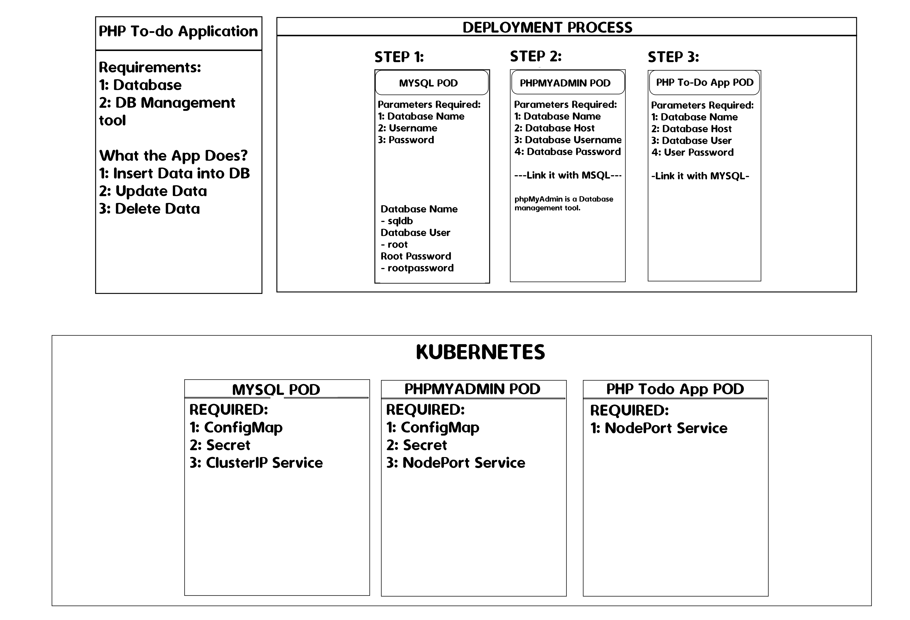

# Documents to deploy a three-tier application on a Kubernetes cluster.

### Creating pod, configmap, secret, build and push docker image for mysql, phpadmin, php app.

### Task diagram


Steps:

### **Mysql database container creation**
- Create Config map for database
    ```
    kubectl create configmap db-config --from-literal=MYSQL_DATABASE=sqldb
    ```
    > configmap/db-config created

- Create secret for database
    ```
    k create secret generic db-secret --from-literal=MYSQL_ROOT_PASSWORD=rootpassword
    ```
    > secret/db-secret created

- Create database pod (Ref: https://hub.docker.com/_/mysql )
    ```
    k run mysql-pod --image=mysql --dry-run=client -o yaml > mysql-pod.yaml
    ```
    > Edit the yaml file and add the configmap and secret under container 
    ```
    section:
        envFrom:
            - configMapRef:
                name: db-config
            - secretRef:
                name: db-secret
    ```
    > Now, apply the manifest to create database pod
    ```
    k apply -f mysql-pod.yaml
    ```
    > Expose database pod within cluster ClusterID which is default (Create service to access database withing cluster)

    ```
    k expose pod mysql-pod --port=3306 --target-port=3306 --name=db-service
    k get svc
    ```
    ```
    NAME         TYPE        CLUSTER-IP    EXTERNAL-IP   PORT(S)    AGE
    db-service   ClusterIP   10.99.4.147   <none>        3306/TCP   7s
    kubernetes   ClusterIP   10.96.0.1     <none>        443/TCP    19d
    ```

### **Phpadmin container creation**
- Ceate config map for phpadmin
    ```
    k create cm phpadmin-configmap --from-literal=PMA_HOST=10.99.4.147 --from-literal=PMA_PORT=3306
    ```

- Ceate secret for phpadmin
    ```
    k create secret generic phpadmin-secret --from-literal=PMA_USER=root --from-literal=PMA_PASSWORD=rootpassword
    ```

- Create phpadmin pod (Ref: https://hub.docker.com/_/phpmyadmin )
    ```
    k run phpadmin-pod --image=phpmyadmin --dry-run=client -o yaml > phpadmin.yaml
    ```

    > Edit the yaml file and add the configmap and secret under container section:
    ```
    envFrom:
    - configMapRef:
        name: phpadmin-configmap
    - secretRef:
        name: phpadmin-secret
    ```

    >Now, apply the manifest to create phpadmin pod
    ```
    k apply -f phpadmin.yaml
    ```


    >Expose phpadmin pod to access from ourside the cluster NodePort (Create service to access phpadmin from outside the cluster)
    ```
    k expose pod phpadmin-pod --type=NodePort --port=8090 --target-port=80 --name=phpadmin-svc
    ```
    
    >Now, you can access the phpadmin using web url: http://10.102.8.25:30783

    _Note: In case you are using Docker desktop or minikube then you have to expose the port from your local machine. Or user Kube forwarder software to do it._
    
### **Build PHP application image and container creation**

- Now build php application image and push to docker hub. 
    ```
    docker login (User your docker login credentials)
    ```
    >Update the mysql connection url in you application.
    
    >e.g - $connection = mysqli_connect('10.99.4.147','root','','rootpassword', 'sqldb');

- Build docker image (user docker file in this code repo)
    ```
    docker build -t yogeshk04/phpapp .
    ```

- Push the docker image to docker hub
    ```
    docker push yogeshk04/phpapp
    ```

- Run php application container
    ```
    k run php-app-pod --image yogeshk04/phpapp
    ```
- Expose php-app pod to access from ourside the cluster NodePort (Create service to access phpaapp from outside the cluster)
    ```
    k expose pod php-app-pod --type=NodePort --port=8088 --target-port=80 --name=phpapp-svc
    ```
- Access the application using url example
    > curl http://10.101.2.235:31176
